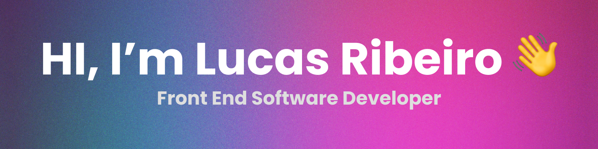

### Olá! Eu sou o Lucas Ribeiro!👋

- I'm currently working on my portfolio.🧑‍💻
- I'm studying Firebase and Styled Components.

## Technologies i'm used to using more:

    
    
    
    
    
    
    
    

 

## Frontend software developer based in Brazil.
- My portfolio: https://lucasdeveloper.netlify.app
- I make programming content on instagram: 💜 https://www.instagram.com/devcodepro
- My Links: 🧑‍💻 https://devlucaslinks.netlify.com
- Where i provide frontend challenges for beginners: ☕ https://devfrontchallenges.netlify.app/
